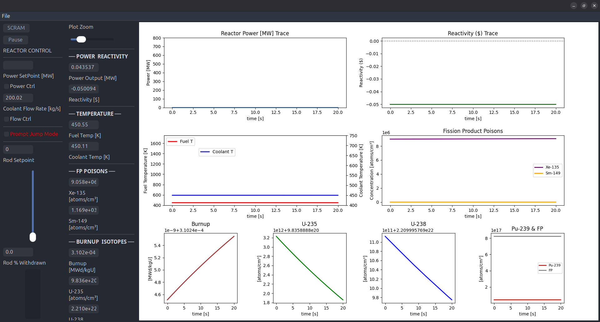

# DUNE - Nuclear Reactor Simulator

## About

DUNE is an advanced point kinetics nuclear reactor simulator with a graphical user interface (GUI) designed for educational purposes and reactor physics demonstrations. This package provides a comprehensive simulation environment that models nuclear reactor behavior, including neutronics, thermal hydraulics, and control systems.

### Key Features

- **Real-time Reactor Simulation**: Implements a 6-group delayed neutron precursor model based on point kinetics equations
- **Fission Product Poisoning**: Complete Xenon-135 and Samarium-149 decay chains with reactivity feedback
- **Interactive GUI**: Full-screen 4-panel layout with wxPython and matplotlib for comprehensive visualization
- **Thermal-Hydraulic Modeling**: Temperature-dependent heat transfer with Dittus-Boelter correlation
- **Dynamic Coolant Flow Control**: Automatic flow rate adjustment based on reactor power (200-1200 kg/s)
- **Manual Coolant Control Mode**: User-controlled coolant flow rate with independent operation
- **Control Systems**: Supports both manual control rod operation and automatic PID-based power control
- **Safety Systems**: Automatic SCRAM functionality based on temperature setpoints
- **Arduino Integration**: Interfaces with physical 3D printed reactor model for hands-on demonstrations
- **CSV Data Logging**: Automatic timestamped data logging including poison concentrations
- **Educational Tool**: Designed for nuclear engineering education


## Project Structure and Components

### Core Modules

#### 1. **reactorPhysics.py** - Nuclear Physics Engine
This module contains the fundamental reactor physics equations and parameters:

- **Point Kinetics Model**: Implements the time-dependent neutron diffusion equations with 6 delayed neutron groups for U-235
- **Delayed Neutron Data**: 
  - Beta values (β₁ through β₆): Individual delayed neutron fractions
  - Lambda values (λ₁ through λ₆): Decay constants ranging from 0.0124 to 3.01 s⁻¹
  - Total delayed neutron fraction: β_total = 0.0065
  - Average neutron lifetime: Λ = 10⁻⁵ seconds

- **Thermal-Hydraulic Models**:
  - Temperature-dependent UO₂ fuel heat capacity
  - Flow-dependent heat transfer using Dittus-Boelter correlation
  - Coupled fuel and coolant temperature evolution
  - Reactivity feedback from temperature coefficients (α_T = -0.007 × 10⁻⁵ per K per beta)

- **Fission Product Poisoning** (NEW in v0.2):
  - **Xenon-135 Dynamics**: Complete I-135 → Xe-135 decay chain
    - I-135 production from fission (γ_I = 0.061)
    - Xe-135 formation from I-135 decay (λ_I = 2.87 × 10⁻⁵ s⁻¹)
    - Xe-135 neutron absorption (σ_a = 2.6 × 10⁶ barns)
    - Xe-135 radioactive decay (λ_X = 2.09 × 10⁻⁵ s⁻¹)
  - **Samarium-149 Dynamics**: Full Nd-149 → Pm-149 → Sm-149 chain
    - Nd-149 production from fission (γ_Nd = 0.0113)
    - Pm-149 formation and decay (half-life: 53.08 hours)
    - Sm-149 as stable poison (σ_a = 40,800 barns)
  - Reactivity contributions: ρ = ρ_rod + ρ_temp + ρ_Xe + ρ_Sm

- **Control Rod Worth**: Total reactivity worth of 0.1$ (fully inserted to fully withdrawn)
  - Sinusoidal differential worth curve (peak at core midplane)
  - Realistic importance-weighted reactivity insertion

- **Power Calculation**: Converts neutron population to thermal power output using:
  - Energy per fission: 3.204 × 10⁻¹¹ J
  - Macroscopic fission cross-section: 0.0065 cm⁻¹
  - Reactor volume: 3 × 10⁶ cm³

#### 2. **reactor.py** - Reactor Control System
The `DUNEReactor` class provides the main interface for reactor operations:

- **State Vector Management**: Tracks 15 variables:
  - [neutrons/cc, C₁-C₆ precursors, T_fuel, T_coolant, rod position, I-135, Xe-135, Nd-149, Pm-149, Sm-149]
- **Time Integration**: Uses scipy's odeint for solving the stiff ODE system
- **Control Rod Dynamics**: Realistic rod motion with rate limiting and 0.1$ total reactivity worth
- **PID Power Control**: Automatic power level regulation
- **Dynamic Coolant Flow Control**: Automatic flow rate adjustment based on reactor power output
  - Power-based flow mapping: 200 kg/s (low power) to 1200 kg/s (high power)
  - Prevents thermal shock with smooth tanh-based ramping
- **Manual Coolant Control Mode**: Direct user control of flow rate independent of power level
- **Safety Systems**:
  - Fuel temperature SCRAM at 1700 K
  - Coolant temperature SCRAM at 700 K
  - Automatic control rod insertion on SCRAM

#### 3. **DUNEReactor.py** - GUI and Visualization
The graphical interface built with wxPython provides:

- **Full-Screen 4-Panel Layout**:
  - **Upper Left**: Real-time power output (MW) vs time
  - **Upper Right**: Reactivity ($) vs time showing feedback dynamics
  - **Lower Left**: Fuel (red) and coolant (blue) temperatures (K) vs time
  - **Lower Right**: Xenon-135 (purple) and Samarium-149 (orange) concentrations vs time

- **Control Interfaces**:
  - Manual control rod position slider
  - Power setpoint control with PID mode toggle
  - Coolant flow rate adjustment with manual control toggle
  - SCRAM button for emergency shutdown
  - Pause/Resume simulation control
  - Zoom controls for plot viewing

- **Monitoring Displays**:
  - Current reactor power (MW)
  - Fuel and coolant temperatures (K)
  - Control rod position (%)
  - Coolant flow rate (kg/s)
  - Xenon-135 concentration (atoms/cm³)
  - Samarium-149 concentration (atoms/cm³)

- **Data Logging System**:
  - Automatic CSV file generation with timestamps
  - Records all critical parameters every 0.5 seconds
  - Saves to SimulationData/ folder automatically
  - Includes: time, neutron density, power, reactivity, temperatures, flow rate, rod position, Xe-135, Sm-149
  - Full poison concentration tracking for post-analysis

- **Arduino Communication**: Serial interface to physical reactor model

#### 4. **Arduino Integration** (arduino/reactorSketch/)
The Arduino code provides physical feedback through:
- **Servo Control**: Moves 3D printed control rods to match simulator position (case 'r')
- **LED Indication**: RGB LED brightness represents reactor power level
  - Blue LED: Normal operation - power level indicator (case 'p')
  - Red LED: SCRAM condition (case 's')
- **Independent Pump Control**: PWM-driven motor for coolant pump simulation (case 'c')
  - Decoupled from power level for realistic coolant system control
  - Motor speed maps to coolant flow rate: 200-1800 kg/s → PWM 20-180
  - Allows demonstration of thermal-hydraulic transients

**Serial Command Protocol**:
- `'p' + value (0-250)`: Power level → Blue LED brightness
- `'c' + value (20-180)`: Coolant flow → Pump motor speed  
- `'r' + value (5-140)`: Rod position → Servo angle
- `'s' + value (0-1)`: SCRAM state → Red LED on/off


**Circuit Diagram**:


The circuit diagram shows the complete wiring configuration for the Arduino-based physical reactor model, including:
- Servo motor connections (Pin 9) for control rod actuation
- RGB LED wiring (Pins 6 and 11) for power level indication
- Motor PWM control (Pin 3) for coolant pump visualization
- Power supply and ground connections
- Resistor values for LED current limiting

## Physics and Mathematical Model

### Neutron Kinetics Equations

The simulator solves the coupled point kinetics equations with 6 delayed neutron groups:

```math
\frac{dn}{dt} = \frac{\rho - \beta}{\Lambda}n + \sum_{i=1}^{6}\lambda_i C_i
```

```math
\frac{dC_i}{dt} = \frac{\beta_i}{\Lambda}n - \lambda_i C_i
```

Where:
- $n$ = neutron population density
- $C_i$ = delayed neutron precursor concentration for group i
- $\rho$ = reactivity (includes temperature feedback)
- $\beta$ = total delayed neutron fraction
- $\beta_i$ = delayed neutron fraction for group i
- $\Lambda$ = prompt neutron lifetime
- $\lambda_i$ = decay constant for group i

### Reactivity Feedback

The total reactivity includes contributions from:
- **Control Rod Position**: Primary control mechanism (0.1$ total worth)
- **Fuel Temperature**: Doppler broadening effect (negative feedback)
- **Coolant Temperature**: Moderator temperature coefficient (negative feedback)
- **Xenon-135 Poisoning**: Transient neutron absorption (negative, time-dependent)
- **Samarium-149 Poisoning**: Equilibrium neutron absorption (negative, builds slowly)

### Thermal Hydraulics

Fuel temperature evolution:
```math
\frac{dT_f}{dt} = \frac{Q_{fission} - h \cdot A_c (T_f - T_c)}{m_f \cdot C_{p,fuel}}
```

Coolant temperature evolution:
```math
\frac{dT_c}{dt} = \frac{h \cdot A_c (T_f - T_c) + \dot{m}_c \cdot C_{p,coolant}(T_{in} - T_c)}{m_c \cdot C_{p,coolant}}
```

Where:
- $Q_{fission}$ = fission power generated
- $h$ = heat transfer coefficient (flow-dependent)
- $A_c$ = fuel-coolant contact area (4 × 10⁵ cm²)
- $\dot{m}_c$ = coolant mass flow rate
- $C_p$ = specific heat capacity

## Reactor Operation Demonstrations

### GUI Overview

The DUNE simulator features a comprehensive full-screen interface with four synchronized real-time plots and extensive monitoring capabilities.

### Full-Screen 4-Panel GUI


The main interface shows four synchronized plots:
- **Upper Left Panel**: Real-time thermal power output (MW) vs time
  - Shows exponential rise during startup, steady-state operation, and decay during shutdown
- **Upper Right Panel**: Total reactivity ($) vs time showing all feedback contributions
  - Displays contributions from control rods, temperature feedback, and poison effects
- **Lower Left Panel**: Fuel (red) and coolant (blue) temperatures (K) vs time
  - Demonstrates thermal inertia and heat transfer dynamics
- **Lower Right Panel**: Xenon-135 (purple) and Samarium-149 (orange) concentrations (atoms/cm³) vs time
  - Tracks fission product poison buildup and decay in real-time

**Key GUI Features**:
- Live parameter updates every 0.5 seconds
- Adjustable time zoom for detailed transient analysis
- Real-time numerical displays for all critical parameters
- Synchronized x-axis across all plots for correlation analysis

### Manual Power Control Mode

Autometically adjust the control rod position through PID controller to achieve the targeted power level.

### Manual Flow Control Mode


Independent coolant flow control enables investigation of thermal-hydraulic effects decoupled from automatic power-based control.

### Startup Transient


This image demonstrates a typical reactor startup sequence showing exponential power rise as control rods are withdrawn. The behavior follows the reactor period equation demonstrating subcritical to critical transition.

### Prompt Jump Phenomenon
.png)

This captures a reactivity insertion accident resulting in a prompt jump. When reactivity exceeds one dollar ($ρ > $1.00), the reactor becomes prompt critical, causing an instantaneous power jump followed by temperature feedback stabilization.

### SCRAM Event


Documentation of an automatic SCRAM (Safety Control Rod Axe Man) event triggered by exceeding temperature safety limits. Shows rapid power decrease as control rods are fully inserted and negative reactivity is added.

### Xenon and Samarium Poisoning


Long-term simulation showing fission product poison buildup:
- **Xenon-135**: Reaches equilibrium in ~40-50 hours with characteristic oscillations
- **Samarium-149**: Builds slowly over days, approaching stable equilibrium
- Both poisons insert negative reactivity requiring compensating rod withdrawal

## Video Demonstrations

The following video demonstrations showcase the DUNE reactor simulator in action:

### Reactor Start-Up
[Media/Videos/Reactor Start-Up.webm](Media/Videos/Reactor%20Start-Up.webm)

Demonstrates the complete reactor startup sequence with control rod withdrawal and exponential power rise.

### Power Control Mode
[Media/Videos/Power Control Mode.webm](Media/Videos/Power%20Control%20Mode.webm)

Shows the automatic PID-based power control system maintaining setpoint power levels.

### Coolant Flow Control Mode
[Media/Videos/Coolant Flow Control Mode.webm](Media/Videos/Coolant%20Flow%20Control%20Mode.webm)

Demonstrates manual coolant flow rate control and its effects on reactor temperatures.

### Reactor SCRAM
[Media/Videos/Reactor SCARM.webm](Media/Videos/Reactor%20SCARM.webm)

Shows emergency shutdown procedure with automatic safety system activation.

### Xenon-135 Negative Reactivity Effect at Start-Up
[Media/Videos/Xenon-135 Negative Reactivity Effect at Start-Up.webm](Media/Videos/Xenon-135%20Negative%20Reactivity%20Effect%20at%20Start-Up.webm)

Illustrates the transient xenon poisoning effects during reactor startup operations.

### Data Collection in CSV
[Media/Videos/Data Collection in CSV.webm](Media/Videos/Data%20Collection%20in%20CSV.webm)

Demonstrates the automatic data logging system and CSV file generation for post-analysis.

## Installation

### Prerequisites

DUNE requires Python 3.6 or higher and the following dependencies:
- **numpy** (≥1.20): Numerical computing and array operations
- **scipy** (≥1.6): ODE solver for reactor kinetics equations
- **matplotlib** (≥3.3): Plotting and data visualization
- **wxPython** (≥4.1): Cross-platform GUI toolkit
- **pyserial** (≥3.0): Serial communication with Arduino (optional)

### Installation Steps

1. **Clone the repository**:
   ```bash
   git clone https://github.com/hridoy/DUNE.git
   cd DUNE
   ```

2. **Install in development mode**:
   ```bash
   python setup.py develop
   ```
   
   Or using pip:
   ```bash
   pip install -e .
   ```

3. **Verify installation**:
   ```bash
   DUNE
   ```

### Arduino Setup (Optional)

For physical reactor model integration:

1. Upload `arduino/reactorSketch/reactorSketch.ino` to your Arduino board
2. Connect servo to pin 9, RGB LED to pins 6 and 11, and motor to pin 3
3. Connect Arduino via USB before starting the simulator
4. The simulator will automatically detect and connect to the Arduino

## Usage Guide

### Starting the Simulator

Launch the reactor GUI with the command:
```bash
DUNE
```

Or run directly with Python:
```bash
python DUNEReactor.py
```

### Operating Modes

#### Manual Control Mode (Default)
- Use the vertical slider to set control rod position (0-100%)
- Rods move at a realistic rate (~10%/second)
- Monitor reactivity in dollars displayed in real-time
- Watch power respond to rod movements with reactor period dynamics

#### Automatic Power Control Mode
1. Check the "Power Control" toggle
2. Set desired power level in the power setpoint box
3. The PID controller automatically adjusts control rods to maintain setpoint
4. Observe how the controller responds to temperature feedback

#### Manual Coolant Control Mode
1. Check the "Flow Ctrl" toggle next to coolant flow rate
2. Enter desired coolant flow rate (200-1800 kg/s)
3. System maintains user-specified flow rate independent of power level
4. Useful for investigating thermal-hydraulic transients and cooling system effects
5. Uncheck to return to automatic power-based flow adjustment

### Control Interfaces

#### Main Controls
- **Rod Position Slider**: Manual control rod height (0% = fully inserted, 100% = fully withdrawn)
- **Power Setpoint**: Target power level in MW for automatic control
- **Power Ctrl Checkbox**: Enable/disable automatic PID power control
- **Coolant Flow**: Adjust coolant mass flow rate (200-1800 kg/s)
- **Flow Ctrl Checkbox**: Enable/disable manual coolant flow control
- **SCRAM Button**: Emergency shutdown - inserts all control rods immediately
  - Press again to reset SCRAM condition and unlock reactor
- **Pause**: Freeze simulation to examine current state

#### Display Monitors
- **Power Plot** (Upper Left): Real-time reactor power in MW
- **Reactivity Plot** (Upper Right): Total reactivity in dollars ($) showing all feedback contributions
- **Temperature Plot** (Lower Left): Fuel temperature (red) and coolant temperature (blue) in Kelvin
- **Poison Plot** (Lower Right): Xenon-135 (purple) and Samarium-149 (orange) concentrations in atoms/cm³
- **Rod Height Indicator**: Vertical bar showing current rod position
- **Xenon-135 Monitor**: Real-time concentration display in scientific notation
- **Samarium-149 Monitor**: Real-time concentration display in scientific notation
- **Time Scale**: Adjustable zoom for viewing different time windows

### Operational Guidelines

#### Safe Startup Procedure
1. Verify coolant flow is adequate (default 1800 kg/s)
2. Slowly withdraw control rods (increase position from 0%)
3. Watch reactivity approach zero dollars
4. Continue rod withdrawal until desired power is reached
5. Fine-tune position to stabilize at target power

#### Understanding Reactivity
- **Subcritical** ($ρ < 0$): Power decreasing, reactor shutting down
- **Critical** ($ρ = 0$): Power stable, equilibrium condition
- **Supercritical** ($ρ > 0$): Power increasing
- **Prompt Critical** ($ρ > $1.00$): Dangerous! Very rapid power increase

#### Temperature Monitoring
- **Fuel Temperature**: Must stay below 1700 K (automatic SCRAM above)
- **Coolant Temperature**: Must stay below 700 K (automatic SCRAM above)
- Temperature increases lag behind power changes due to thermal inertia
- Higher coolant flow improves heat removal and lowers temperatures

#### CSV Data Logging
- **Automatic Recording**: All simulations are logged automatically
- **Storage Location**: Data saved in `SimulationData/` folder
- **Filename Format**: `reactor_sim_YYYY-MM-DD_HH-MM-SS.csv`
- **Logging Interval**: Data recorded every 0.5 seconds
- **Saved Parameters**: 
  - Time, neutron density, power (MW), reactivity ($)
  - Fuel temperature, coolant temperature, flow rate, rod position
  - Xenon-135 concentration, Samarium-149 concentration
- **File Closure**: CSV automatically saved when simulation exits
- **Post-Processing**: Open CSV files in Excel, MATLAB, Python, or other analysis tools
- **Long-Term Studies**: Ideal for analyzing poison transients and equilibrium behavior

### Safety Systems

The simulator includes realistic safety features:

1. **Automatic SCRAM Triggers**:
   - Fuel temperature > 1700 K
   - Coolant temperature > 700 K
   - Both conditions cause immediate rod insertion

2. **SCRAM Recovery**:
   - Click SCRAM button again to unlock
   - Reactor must be manually restarted from subcritical state
   - Delayed neutron precursors must rebuild (takes 30-60 seconds)

3. **Physical Limits**:
   - Rods cannot be withdrawn beyond 100%
   - Rods cannot be inserted below 0%
   - Coolant flow has minimum/maximum bounds

### Experimental Scenarios

#### Experiment 1: Reactor Period
- Start with rods at 0%
- Quickly move to 45% and hold
- Observe exponential power rise
- Calculate reactor period from plot: $T = \frac{t}{\ln(P_2/P_1)}$

#### Experiment 2: Temperature Feedback
- Establish steady state at high power (400+ MW)
- Suddenly reduce coolant flow by 50%
- Observe power reduction due to negative temperature feedback
- Demonstrates inherent safety of negative temperature coefficients

#### Experiment 2b: Coolant Flow Transients (New)
- Enable manual coolant control mode
- Start at steady state with normal flow (1000 kg/s)
- Reduce flow to minimum (200 kg/s) and observe temperature rise
- Increase flow to maximum (1800 kg/s) and observe cooling effect
- Note how reactor power self-regulates through temperature feedback
- Export CSV data and plot temperature vs. flow rate relationship

#### Experiment 3: Prompt Criticality
- **WARNING**: For educational observation only!
- Starting from low power, rapidly insert large reactivity (>$1.00)
- Observe prompt jump followed by temperature-limited stabilization
- Shows importance of staying below prompt critical limit

#### Experiment 4: SCRAM Response
- Operate at high power
- Press SCRAM button
- Observe power decay from delayed neutrons
- Note the characteristic decay time (~80 seconds for 6-group model)

#### Experiment 5: Xenon Transients (NEW)
- **Xenon Buildup**: Start reactor at high power (500+ MW)
- Run for 24-48 hours to observe Xe-135 equilibrium
- Note reactivity decrease of ~0.03-0.05$ as xenon builds
- **Xenon-Free Window**: After SCRAM, xenon peaks then decays
- Restart window appears after ~11 hours when Xe-135 has decayed sufficiently
- CSV data captures full transient for analysis

#### Experiment 6: Samarium Accumulation (NEW)
- Long-term simulation (72+ hours) at steady power
- Observe slow Sm-149 buildup through Nd-149 → Pm-149 → Sm-149 chain
- Samarium reaches equilibrium in 3-5 days
- Compare equilibrium Sm-149 reactivity worth (smaller but permanent vs transient Xe-135)
- Export poison concentration data for decay chain analysis

## Educational Applications

### Target Audiences
- **K-12 Students**: Introduction to nuclear energy and reactor safety
- **Undergraduate Engineering**: Reactor physics and control systems
- **Public Outreach**: Demonstrations at science fairs and events
- **Training**: Basic reactor operation concepts

### Learning Objectives
1. Understand neutron population dynamics and delayed neutrons
2. Learn about reactivity and reactor control
3. Observe temperature feedback effects
4. Experience safety system operation
5. Appreciate the role of control systems in reactor operation
6. Study fission product poison dynamics (Xenon-135 and Samarium-149)
7. Analyze long-term reactor behavior and equilibrium conditions
8. Understand reactivity management during fuel burnup

### Classroom Integration
- Use with 3D printed physical model for tactile learning experience
- LED brightness provides visual feedback of power level
- Moving servo demonstrates control rod mechanism
- Combine with discussion of real reactor designs (PWR, BWR, etc.)

## Technical Details

### Numerical Methods
- **ODE Solver**: scipy.integrate.odeint with adaptive step sizing
- **Time Step**: Default 5 ms for stability with stiff equations
- **Update Rate**: GUI refreshes at 1 Hz, physics calculates at 500 Hz
- **Numerical Stability**: Implicit solver handles stiff reactor kinetics

### Model Fidelity
- 6-group delayed neutron model (industry standard for training simulators)
- Complete Xenon-135 and Samarium-149 fission product chains
- Lumped parameter thermal hydraulics (0D approximation)
- Point kinetics (spatially averaged neutronics)
- Representative of small research reactor or PWR unit cell
- Control rod worth calibrated to 0.1$ for realistic control margin

### Performance
- Real-time capable on modern hardware
- Scales to 1000x faster-than-real-time for rapid scenario testing
- Memory efficient with circular buffer for plot data

### Code Architecture
- **Model-View-Controller** design pattern
- Physics engine separated from GUI for testability
- Extensible for additional physics models
- Well-documented with inline comments

## Troubleshooting

### Common Issues

**Arduino not detected**:
- Check USB connection and permissions
- Verify correct COM port in device manager
- Ensure pyserial is installed: `pip install pyserial`

**GUI not displaying**:
- Install wxPython: `pip install wxPython`
- On Linux, may need system packages: `sudo apt-get install python3-wxgtk4.0`

**Simulation crashes**:
- Reduce time step if numerical instabilities occur
- Check that initial conditions are physical
- Ensure numpy/scipy versions are compatible

**Slow performance**:
- Increase plot update interval (decrease refresh rate)
- Reduce stored data history length
- Close other applications

### Debug Mode
Enable verbose output for troubleshooting:
```python
# In DUNEReactor.py, add:
import logging
logging.basicConfig(level=logging.DEBUG)
```


## Future Enhancements

Potential improvements and extensions:

### Physics Models
- [x] Xenon-135 poisoning dynamics (Completed v0.2)
- [x] Samarium-149 poisoning dynamics (Completed v0.2)
- [ ] Burnup and fuel depletion tracking
- [ ] Multi-region core model (radial/axial variations)
- [ ] Improved neutron kinetics with spatial effects

### Control Systems
- [ ] Advanced control algorithms (MPC, fuzzy logic)
- [ ] Load-following operation modes
- [ ] Grid frequency response simulation
- [ ] Multiple control rod banks

### Visualization
- [x] CSV data export for post-processing (Completed v0.1)
- [x] 4-panel full-screen layout (Completed v0.2)
- [x] Poison concentration monitoring (Completed v0.2)
- [ ] 3D reactor core visualization
- [ ] Neutron flux distribution animation
- [ ] Export data to HDF5 format

### Hardware Integration
- [ ] Support for additional Arduino sensors (temperature, flow)
- [ ] Raspberry Pi integration for standalone operation
- [ ] Multiple 3D printed reactor units for comparison
- [ ] VR/AR visualization support

## Contributing

Contributions are welcome! Areas where help is needed:

- Documentation improvements and tutorials
- Additional example scenarios and lesson plans
- Testing on different platforms
- Bug reports and feature requests
- Translation to other languages

Please submit issues and pull requests on GitHub.

## Documentation

For comprehensive technical documentation, including detailed reactor physics derivations, implementation details, and experimental results, please refer to:

**[DUNE Project Report](doc/DUNE%20Report.pdf)** - Complete technical documentation covering:
- Theoretical background and nuclear physics equations
- System architecture and software design
- Hardware integration and Arduino implementation
- Validation and testing results
- Educational applications and case studies
- Performance analysis and benchmarking

## Publications and Presentations

This simulator has been used in:
- University reactor physics courses
- Public science demonstrations
- Nuclear engineering department open houses

## Acknowledgments

- Original pyReactor concept: William Gurecky (https://github.com/wgurecky/pyReactor)
- Current development and enhancements: Hridoy Kabiraj
- Delayed neutron data from ENDF/B-VII.1 nuclear data library
- Fission product yield data from JEFF-3.3 library
- Inspiration from commercial reactor training simulators
- Special thanks to educators who provided feedback

## Related Resources

### Learning Materials
- [Nuclear Reactor Physics (Lamarsh & Baratta)](https://www.pearson.com/en-us/subject-catalog/p/introduction-to-nuclear-engineering/P200000003276)
- [Fundamentals of Nuclear Science and Engineering (Shultis & Faw)](https://www.crcpress.com/Fundamentals-of-Nuclear-Science-and-Engineering-Third-Edition/Shultis-Faw/p/book/9781498769297)
- [MIT OpenCourseWare: Nuclear Engineering](https://ocw.mit.edu/courses/22-01-introduction-to-nuclear-engineering-and-ionizing-radiation-fall-2016/)

### Similar Projects
- [OpenMC](https://openmc.org/): Monte Carlo particle transport code
- [SCALE](https://www.ornl.gov/scale): Comprehensive nuclear safety analysis suite  
- [Serpent](http://montecarlo.vtt.fi/): Reactor physics burnup calculation code

### Nuclear Engineering Organizations
- [American Nuclear Society (ANS)](https://www.ans.org/)
- [International Atomic Energy Agency (IAEA)](https://www.iaea.org/)
- [Nuclear Energy Institute (NEI)](https://www.nei.org/)

## Frequently Asked Questions (FAQ)

**Q: Is this simulator accurate for real reactor design?**  
A: No. DUNE uses simplified point kinetics and 0D thermal hydraulics suitable for education and conceptual understanding. Real reactor design requires detailed 3D neutronics and CFD analysis.

**Q: Can I use this for homework/projects?**  
A: Yes! The software is open source and free to use for educational purposes. Please cite this repository in your work.

**Q: How realistic are the physics models?**  
A: The 6-group delayed neutron model is standard for training simulators. Thermal hydraulics are simplified but capture essential behavior. Good for qualitative understanding, not quantitative design.

**Q: Why does the reactor SCRAM when I withdraw rods too quickly?**  
A: Rapid rod withdrawal causes power to rise exponentially. Power heats the fuel, and if temperature limits are exceeded, automatic SCRAM occurs. This demonstrates the importance of controlled startups.

**Q: What's the difference between dollars and absolute reactivity?**  
A: Reactivity in dollars ($) is normalized by β (delayed neutron fraction). $1.00 is the prompt critical threshold. Absolute reactivity ρ has units of Δk/k.

**Q: Can I modify the reactor parameters?**  
A: Yes! Edit `reactorPhysics.py` to change core size, fuel type, temperature coefficients, control rod worth, etc. Rerun `python setup.py develop` after changes.

**Q: Why is there a delay after SCRAM before I can restart?**  
A: Delayed neutron precursors (with half-lives of 0.2 to 55 seconds) must decay. Real reactors also have xenon buildup considerations. In this simulator, Xe-135 concentration affects restart capability.

**Q: What's the difference between Xenon-135 and Samarium-149?**  
A: Xenon-135 is a transient poison (9.2 hour half-life) with very high absorption cross-section (2.6M barns). It builds up and decays relatively quickly. Samarium-149 is effectively stable with lower absorption (40.8K barns) but builds slowly through a longer decay chain and represents permanent reactivity loss.

**Q: Does this work on Raspberry Pi?**  
A: It should work but may be slow. The GUI is computationally intensive. Consider using a more powerful computer for smooth operation.

## Version History

### Version 0.2 (February 2026 - Current)
- **NEW**: Xenon-135 fission product poisoning with complete I-135 → Xe-135 decay chain
- **NEW**: Samarium-149 fission product poisoning with Nd-149 → Pm-149 → Sm-149 decay chain
- **NEW**: Full-screen 4-panel GUI layout with synchronized plots
- **NEW**: Real-time poison concentration monitoring (Xe-135 and Sm-149)
- **NEW**: Reactivity plot showing rod, temperature, and poison contributions
- **NEW**: Enhanced CSV logging with poison concentration columns
- **UPDATED**: Control rod total worth set to 0.1$ (from ~0.05$)
- **UPDATED**: State vector expanded to 15 dimensions (added I, Xe, Nd, Pm, Sm)
- **UPDATED**: Renamed from pyReactor/legoReactor to DUNE/DUNEReactor
- **IMPROVED**: Documentation with comprehensive fission product theory

### Version 0.1.1 (January 2026)
- **NEW**: Dynamic coolant flow control - automatic adjustment based on reactor power
- **NEW**: Manual coolant control mode with independent flow rate setting
- **NEW**: CSV data logging system with automatic timestamped file generation
- **NEW**: Arduino case 'c' command for independent pump speed control
- **NEW**: Flow control checkbox in GUI for toggling manual mode
- **IMPROVED**: Coolant flow rate display updates only in automatic mode
- **IMPROVED**: Enhanced thermal-hydraulic coupling with flow-based control

### Version 0.1 (Initial Release)
- Initial public release
- 6-group delayed neutron model
- Temperature-dependent thermal hydraulics
- PID power control
- Arduino/LEGO integration
- wxPython GUI with matplotlib plots
- Automatic SCRAM systems

### Planned for Version 0.3
- Xenon oscillation studies and load-following scenarios
- Enhanced parameter configuration UI
- Pre-configured scenario library (startup, shutdown, load-follow, etc.)
- Burnup calculations with continuous fuel depletion
- Enhanced documentation and video tutorials

## Authors

**Hridoy Kabiraj**  
Email: rudrokabiraj@gmail.com  
GitHub: [@hridoy](https://github.com/Hridoy-Kabiraj)

**Original Developer: William Gurecky**

## License

This project is currently unlicensed. All rights reserved by the author.

For usage permissions or licensing inquiries, please contact the author.

---

## Contact and Support

For questions, bug reports, or feature requests:
- Open an issue on [GitHub](https://github.com/hridoy/DUNE/issues)
- Email: rudrokabiraj@gmail.com

For educational partnerships or collaboration inquiries, please reach out via email.

---

**⚠️ Disclaimer**: This software is for educational and demonstration purposes only. It is not intended for use in actual nuclear reactor design, operation, or safety analysis. Always consult qualified nuclear engineers and follow proper regulatory procedures for real reactor systems.

---

*Last Updated: February 2026*
